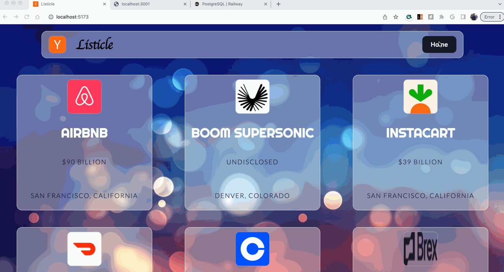

# WEB103 Project 1 and 2 - *Listicle V1*

Submitted by: **Sanskar Lamsal**

About this web app: *Listicle is a web app that allows user to check the top 10 Y Combinator Companies**

Time spent: **5 + 1.5** hours

## Required Features

The following **required** functionality is completed:

- [X] **The web app uses only HTML, CSS, and JavaScript without a frontend framework**
- [X] **The web app displays a title**
- [X] **The web app displays at least five list items, each with at least three attributes (such as title, text, and image url)**
- [X] **The user can click on each item in the list to see a detailed view of it, including all database fields**
  - [X] *Note: When showing this feature in the video walkthrough, please show the unique URL for each detailed view. We will not be able to give points if we cannot see the implementation* 
- [X] **The web app serves an appropriate 404 page when no matching route is defined**

- [X] **The web app uses only HTML, CSS, and JavaScript without a frontend framework**
- [X] **The web app is connected to a PostgreSQL database, with an appropriately structured database table for the list items**
- [X] **The PostgreSQL database includes a table that matches the data displayed in the web app**
  - [X] **NOTE: Your GIF or a screenshot added to the README must include a view of your Railway database that shows the contents of the table used by your app**

The following **optional** features are implemented:

- [X] The web app displays items in a unique format, such as cards rather than lists
- [ ] The user can search for items with a specific attribute

The following **additional** features are implemented:

- [X] Styled using CSS, Made a glass like format with shadows and blurs

## Video Walkthrough
Here's a walkthrough of implemented required features:

GIF created with LiceCap

## Notes

Formatting CSS is always a challange. I am learning to be better day by day.

## License

Copyright [2023] [Sanskar Lamsal]

Licensed under the Apache License, Version 2.0 (the "License"); you may not use this file except in compliance with the License. You may obtain a copy of the License at

> http://www.apache.org/licenses/LICENSE-2.0

Unless required by applicable law or agreed to in writing, software distributed under the License is distributed on an "AS IS" BASIS, WITHOUT WARRANTIES OR CONDITIONS OF ANY KIND, either express or implied. See the License for the specific language governing permissions and limitations under the License.